# Projects and dependencies analysis

This document provides a comprehensive overview of the projects and their dependencies in the context of upgrading to .NETCoreApp,Version=v10.0.

## Table of Contents

- [Executive Summary](#executive-Summary)
  - [Highlevel Metrics](#highlevel-metrics)
  - [Projects Compatibility](#projects-compatibility)
  - [Package Compatibility](#package-compatibility)
  - [API Compatibility](#api-compatibility)
- [Aggregate NuGet packages details](#aggregate-nuget-packages-details)
- [Top API Migration Challenges](#top-api-migration-challenges)
  - [Technologies and Features](#technologies-and-features)
  - [Most Frequent API Issues](#most-frequent-api-issues)
- [Projects Relationship Graph](#projects-relationship-graph)
- [Project Details](#project-details)

  - [docs\CustomNodesLinks\CustomNodesLinks.csproj](#docscustomnodeslinkscustomnodeslinkscsproj)
  - [docs\Diagram-Demo\Diagram-Demo.csproj](#docsdiagram-demodiagram-democsproj)
  - [docs\Layouts\Layouts.csproj](#docslayoutslayoutscsproj)
  - [samples\ServerSide\ServerSide.csproj](#samplesserversideserversidecsproj)
  - [samples\SharedDemo\SharedDemo.csproj](#samplesshareddemoshareddemocsproj)
  - [samples\Wasm\Wasm.csproj](#sampleswasmwasmcsproj)
  - [site\Site\Site.csproj](#sitesitesitecsproj)
  - [src\Blazor.Diagrams.Algorithms\Blazor.Diagrams.Algorithms.csproj](#srcblazordiagramsalgorithmsblazordiagramsalgorithmscsproj)
  - [src\Blazor.Diagrams.Core\Blazor.Diagrams.Core.csproj](#srcblazordiagramscoreblazordiagramscorecsproj)
  - [src\Blazor.Diagrams\Blazor.Diagrams.csproj](#srcblazordiagramsblazordiagramscsproj)
  - [tests\Blazor.Diagrams.Core.Tests\Blazor.Diagrams.Core.Tests.csproj](#testsblazordiagramscoretestsblazordiagramscoretestscsproj)
  - [tests\Blazor.Diagrams.Tests\Blazor.Diagrams.Tests.csproj](#testsblazordiagramstestsblazordiagramstestscsproj)

## Executive Summary

### Highlevel Metrics

| Metric | Count | Status |
| :--- | :---: | :--- |
| Total Projects | 12 | All require upgrade |
| Total NuGet Packages | 19 | 7 need upgrade |
| Total Code Files | 220 |  |
| Total Code Files with Incidents | 21 |  |
| Total Lines of Code | 12385 |  |
| Total Number of Issues | 38 |  |
| Estimated LOC to modify | 13+ | at least 0.1% of codebase |

### Projects Compatibility

| Project | Target Framework | Difficulty | Package Issues | API Issues | Est. LOC Impact | Description |
| :--- | :---: | :---: | :---: | :---: | :---: | :--- |
| [docs\CustomNodesLinks\CustomNodesLinks.csproj](#docscustomnodeslinkscustomnodeslinkscsproj) | net9.0 | 🟢 Low | 0 | 2 | 2+ | AspNetCore, Sdk Style = True |
| [docs\Diagram-Demo\Diagram-Demo.csproj](#docsdiagram-demodiagram-democsproj) | net9.0 | 🟢 Low | 0 | 2 | 2+ | AspNetCore, Sdk Style = True |
| [docs\Layouts\Layouts.csproj](#docslayoutslayoutscsproj) | net9.0 | 🟢 Low | 0 | 2 | 2+ | AspNetCore, Sdk Style = True |
| [samples\ServerSide\ServerSide.csproj](#samplesserversideserversidecsproj) | net9.0 | 🟢 Low | 0 | 1 | 1+ | AspNetCore, Sdk Style = True |
| [samples\SharedDemo\SharedDemo.csproj](#samplesshareddemoshareddemocsproj) | net9.0 | 🟢 Low | 2 | 0 |  | ClassLibrary, Sdk Style = True |
| [samples\Wasm\Wasm.csproj](#sampleswasmwasmcsproj) | net9.0 | 🟢 Low | 3 | 3 | 3+ | AspNetCore, Sdk Style = True |
| [site\Site\Site.csproj](#sitesitesitecsproj) | net9.0 | 🟢 Low | 2 | 3 | 3+ | AspNetCore, Sdk Style = True |
| [src\Blazor.Diagrams.Algorithms\Blazor.Diagrams.Algorithms.csproj](#srcblazordiagramsalgorithmsblazordiagramsalgorithmscsproj) | net10.0;net9.0;net8.0;net7.0;net6.0 | 🟢 Low | 0 | 0 |  | ClassLibrary, Sdk Style = True |
| [src\Blazor.Diagrams.Core\Blazor.Diagrams.Core.csproj](#srcblazordiagramscoreblazordiagramscorecsproj) | net10.0;net9.0;net8.0;net7.0;net6.0 | 🟢 Low | 0 | 0 |  | ClassLibrary, Sdk Style = True |
| [src\Blazor.Diagrams\Blazor.Diagrams.csproj](#srcblazordiagramsblazordiagramscsproj) | net10.0;net9.0;net8.0;net7.0;net6.0 | 🟢 Low | 2 | 0 |  | ClassLibrary, Sdk Style = True |
| [tests\Blazor.Diagrams.Core.Tests\Blazor.Diagrams.Core.Tests.csproj](#testsblazordiagramscoretestsblazordiagramscoretestscsproj) | net10.0;net9.0;net8.0;net7.0;net6.0 | 🟢 Low | 2 | 0 |  | DotNetCoreApp, Sdk Style = True |
| [tests\Blazor.Diagrams.Tests\Blazor.Diagrams.Tests.csproj](#testsblazordiagramstestsblazordiagramstestscsproj) | net10.0;net9.0;net8.0;net7.0;net6.0 | 🟢 Low | 2 | 0 |  | DotNetCoreApp, Sdk Style = True |

### Package Compatibility

| Status | Count | Percentage |
| :--- | :---: | :---: |
| ✅ Compatible | 12 | 63.2% |
| ⚠️ Incompatible | 0 | 0.0% |
| 🔄 Upgrade Recommended | 7 | 36.8% |
| ***Total NuGet Packages*** | ***19*** | ***100%*** |

### API Compatibility

| Category | Count | Impact |
| :--- | :---: | :--- |
| 🔴 Binary Incompatible | 0 | High - Require code changes |
| 🟡 Source Incompatible | 3 | Medium - Needs re-compilation and potential conflicting API error fixing |
| 🔵 Behavioral change | 10 | Low - Behavioral changes that may require testing at runtime |
| ✅ Compatible | 20790 |  |
| ***Total APIs Analyzed*** | ***20803*** |  |

## Aggregate NuGet packages details

| Package | Current Version | Suggested Version | Projects | Description |
| :--- | :---: | :---: | :--- | :--- |
| bunit | 1.36.0 |  | [Blazor.Diagrams.Tests.csproj](#testsblazordiagramstestsblazordiagramstestscsproj) | ✅Compatible |
| coverlet.collector | 6.0.0 |  | [Blazor.Diagrams.Core.Tests.csproj](#testsblazordiagramscoretestsblazordiagramscoretestscsproj) [Blazor.Diagrams.Tests.csproj](#testsblazordiagramstestsblazordiagramstestscsproj) | ✅Compatible |
| FluentAssertions | 6.12.0 |  | [Blazor.Diagrams.Core.Tests.csproj](#testsblazordiagramscoretestsblazordiagramscoretestscsproj) [Blazor.Diagrams.Tests.csproj](#testsblazordiagramstestsblazordiagramstestscsproj) | ✅Compatible |
| GraphShape | 1.2.1 |  | [Layouts.csproj](#docslayoutslayoutscsproj) | ✅Compatible |
| MatBlazor | 2.10.0 |  | [Layouts.csproj](#docslayoutslayoutscsproj) | ✅Compatible |
| Microsoft.AspNetCore.Components | 10 | 10.0.2 | [Blazor.Diagrams.csproj](#srcblazordiagramsblazordiagramscsproj) | NuGet package upgrade is recommended |
| Microsoft.AspNetCore.Components | 9 | 10.0.2 | [SharedDemo.csproj](#samplesshareddemoshareddemocsproj) | NuGet package upgrade is recommended |
| Microsoft.AspNetCore.Components.Web | 10 | 10.0.2 | [Blazor.Diagrams.csproj](#srcblazordiagramsblazordiagramscsproj) | NuGet package upgrade is recommended |
| Microsoft.AspNetCore.Components.Web | 9 | 10.0.2 | [SharedDemo.csproj](#samplesshareddemoshareddemocsproj) | NuGet package upgrade is recommended |
| Microsoft.AspNetCore.Components.WebAssembly | 9 | 10.0.2 | [Site.csproj](#sitesitesitecsproj) [Wasm.csproj](#sampleswasmwasmcsproj) | NuGet package upgrade is recommended |
| Microsoft.AspNetCore.Components.WebAssembly.DevServer | 9 | 10.0.2 | [Site.csproj](#sitesitesitecsproj) [Wasm.csproj](#sampleswasmwasmcsproj) | NuGet package upgrade is recommended |
| Microsoft.NET.Test.Sdk | 17.8.0 |  | [Blazor.Diagrams.Core.Tests.csproj](#testsblazordiagramscoretestsblazordiagramscoretestscsproj) [Blazor.Diagrams.Tests.csproj](#testsblazordiagramstestsblazordiagramstestscsproj) | ✅Compatible |
| Moq | 4.18.4 |  | [Blazor.Diagrams.Core.Tests.csproj](#testsblazordiagramscoretestsblazordiagramscoretestscsproj) [Blazor.Diagrams.Tests.csproj](#testsblazordiagramstestsblazordiagramstestscsproj) | ✅Compatible |
| SvgPathProperties | 1.1.2 |  | [Blazor.Diagrams.Core.csproj](#srcblazordiagramscoreblazordiagramscorecsproj) | ✅Compatible |
| System.Net.Http | 4.3.4 |  | [Blazor.Diagrams.Core.Tests.csproj](#testsblazordiagramscoretestsblazordiagramscoretestscsproj) [Blazor.Diagrams.Tests.csproj](#testsblazordiagramstestsblazordiagramstestscsproj) | NuGet package functionality is included with framework reference |
| System.Net.Http.Json | 9.0.0 | 10.0.2 | [Wasm.csproj](#sampleswasmwasmcsproj) | NuGet package upgrade is recommended |
| System.Text.RegularExpressions | 4.3.1 |  | [Blazor.Diagrams.Core.Tests.csproj](#testsblazordiagramscoretestsblazordiagramscoretestscsproj) [Blazor.Diagrams.Tests.csproj](#testsblazordiagramstestsblazordiagramstestscsproj) | NuGet package functionality is included with framework reference |
| xunit | 2.6.3 |  | [Blazor.Diagrams.Core.Tests.csproj](#testsblazordiagramscoretestsblazordiagramscoretestscsproj) [Blazor.Diagrams.Tests.csproj](#testsblazordiagramstestsblazordiagramstestscsproj) | ✅Compatible |
| xunit.runner.visualstudio | 2.5.5 |  | [Blazor.Diagrams.Core.Tests.csproj](#testsblazordiagramscoretestsblazordiagramscoretestscsproj) [Blazor.Diagrams.Tests.csproj](#testsblazordiagramstestsblazordiagramstestscsproj) | ✅Compatible |

## Top API Migration Challenges

### Technologies and Features

| Technology | Issues | Percentage | Migration Path |
| :--- | :---: | :---: | :--- |

### Most Frequent API Issues

| API | Count | Percentage | Category |
| :--- | :---: | :---: | :--- |
| M:Microsoft.AspNetCore.Builder.ExceptionHandlerExtensions.UseExceptionHandler(Microsoft.AspNetCore.Builder.IApplicationBuilder,System.String) | 4 | 30.8% | Behavioral Change |
| T:System.Uri | 4 | 30.8% | Behavioral Change |
| P:Microsoft.AspNetCore.Components.Routing.Router.PreferExactMatches | 3 | 23.1% | Source Incompatible |
| M:System.Uri.#ctor(System.String) | 2 | 15.4% | Behavioral Change |

## Projects Relationship Graph

Legend:
📦 SDK-style project
⚙️ Classic project

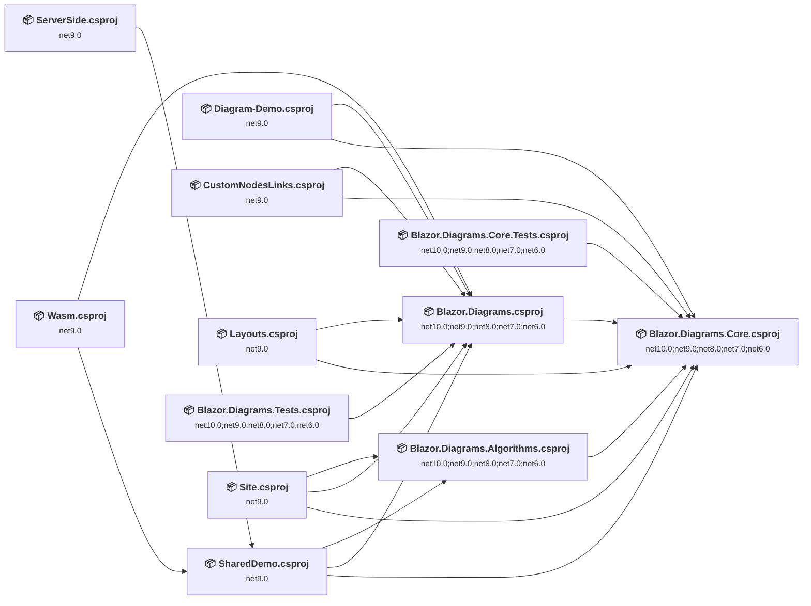

## Project Details

### docs\CustomNodesLinks\CustomNodesLinks.csproj

#### Project Info

- **Current Target Framework:** net9.0
- **Proposed Target Framework:** net10.0
- **SDK-style**: True
- **Project Kind:** AspNetCore
- **Dependencies**: 2
- **Dependants**: 0
- **Number of Files**: 29
- **Number of Files with Incidents**: 3
- **Lines of Code**: 230
- **Estimated LOC to modify**: 2+ (at least 0.9% of the project)

#### Dependency Graph

Legend:
📦 SDK-style project
⚙️ Classic project

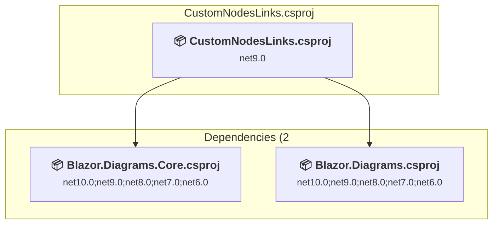

### API Compatibility

| Category | Count | Impact |
| :--- | :---: | :--- |
| 🔴 Binary Incompatible | 0 | High - Require code changes |
| 🟡 Source Incompatible | 1 | Medium - Needs re-compilation and potential conflicting API error fixing |
| 🔵 Behavioral change | 1 | Low - Behavioral changes that may require testing at runtime |
| ✅ Compatible | 745 |  |
| ***Total APIs Analyzed*** | ***747*** |  |

### docs\Diagram-Demo\Diagram-Demo.csproj

#### Project Info

- **Current Target Framework:** net9.0
- **Proposed Target Framework:** net10.0
- **SDK-style**: True
- **Project Kind:** AspNetCore
- **Dependencies**: 2
- **Dependants**: 0
- **Number of Files**: 26
- **Number of Files with Incidents**: 3
- **Lines of Code**: 184
- **Estimated LOC to modify**: 2+ (at least 1.1% of the project)

#### Dependency Graph

Legend:
📦 SDK-style project
⚙️ Classic project

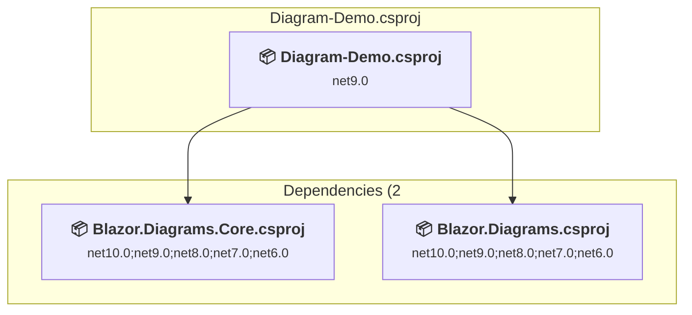

### API Compatibility

| Category | Count | Impact |
| :--- | :---: | :--- |
| 🔴 Binary Incompatible | 0 | High - Require code changes |
| 🟡 Source Incompatible | 1 | Medium - Needs re-compilation and potential conflicting API error fixing |
| 🔵 Behavioral change | 1 | Low - Behavioral changes that may require testing at runtime |
| ✅ Compatible | 770 |  |
| ***Total APIs Analyzed*** | ***772*** |  |

### docs\Layouts\Layouts.csproj

#### Project Info

- **Current Target Framework:** net9.0
- **Proposed Target Framework:** net10.0
- **SDK-style**: True
- **Project Kind:** AspNetCore
- **Dependencies**: 2
- **Dependants**: 0
- **Number of Files**: 24
- **Number of Files with Incidents**: 3
- **Lines of Code**: 187
- **Estimated LOC to modify**: 2+ (at least 1.1% of the project)

#### Dependency Graph

Legend:
📦 SDK-style project
⚙️ Classic project

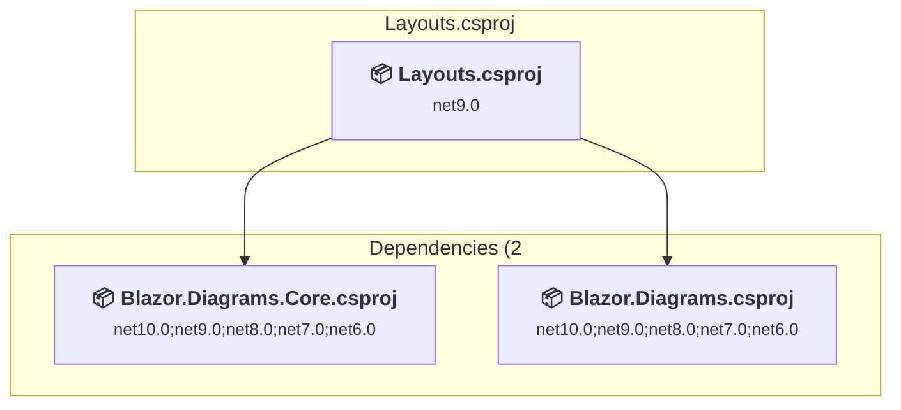

### API Compatibility

| Category | Count | Impact |
| :--- | :---: | :--- |
| 🔴 Binary Incompatible | 0 | High - Require code changes |
| 🟡 Source Incompatible | 1 | Medium - Needs re-compilation and potential conflicting API error fixing |
| 🔵 Behavioral change | 1 | Low - Behavioral changes that may require testing at runtime |
| ✅ Compatible | 836 |  |
| ***Total APIs Analyzed*** | ***838*** |  |

### samples\ServerSide\ServerSide.csproj

#### Project Info

- **Current Target Framework:** net9.0
- **Proposed Target Framework:** net10.0
- **SDK-style**: True
- **Project Kind:** AspNetCore
- **Dependencies**: 1
- **Dependants**: 0
- **Number of Files**: 9
- **Number of Files with Incidents**: 2
- **Lines of Code**: 117
- **Estimated LOC to modify**: 1+ (at least 0.9% of the project)

#### Dependency Graph

Legend:
📦 SDK-style project
⚙️ Classic project

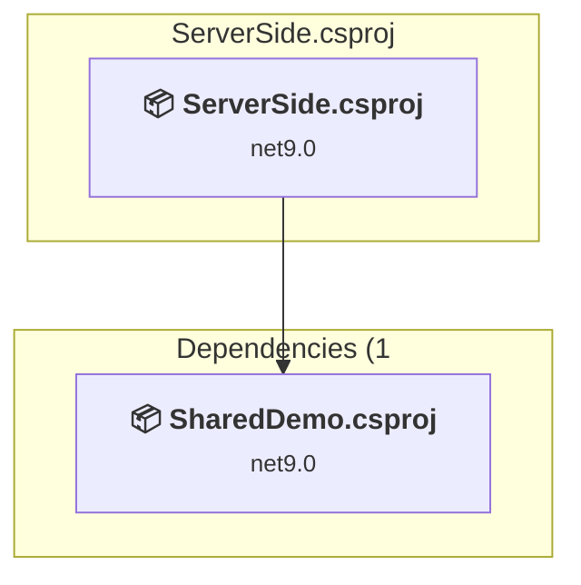

### API Compatibility

| Category | Count | Impact |
| :--- | :---: | :--- |
| 🔴 Binary Incompatible | 0 | High - Require code changes |
| 🟡 Source Incompatible | 0 | Medium - Needs re-compilation and potential conflicting API error fixing |
| 🔵 Behavioral change | 1 | Low - Behavioral changes that may require testing at runtime |
| ✅ Compatible | 767 |  |
| ***Total APIs Analyzed*** | ***768*** |  |

### samples\SharedDemo\SharedDemo.csproj

#### Project Info

- **Current Target Framework:** net9.0
- **Proposed Target Framework:** net10.0
- **SDK-style**: True
- **Project Kind:** ClassLibrary
- **Dependencies**: 3
- **Dependants**: 2
- **Number of Files**: 2567
- **Number of Files with Incidents**: 1
- **Lines of Code**: 1554
- **Estimated LOC to modify**: 0+ (at least 0.0% of the project)

#### Dependency Graph

Legend:
📦 SDK-style project
⚙️ Classic project

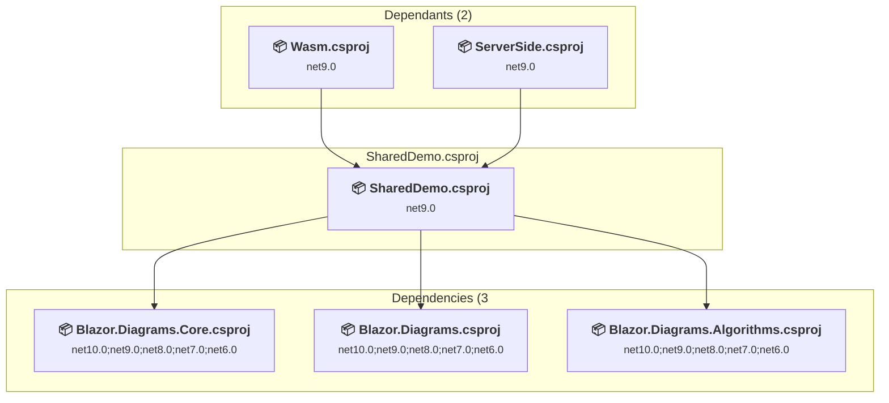

### API Compatibility

| Category | Count | Impact |
| :--- | :---: | :--- |
| 🔴 Binary Incompatible | 0 | High - Require code changes |
| 🟡 Source Incompatible | 0 | Medium - Needs re-compilation and potential conflicting API error fixing |
| 🔵 Behavioral change | 0 | Low - Behavioral changes that may require testing at runtime |
| ✅ Compatible | 3079 |  |
| ***Total APIs Analyzed*** | ***3079*** |  |

### samples\Wasm\Wasm.csproj

#### Project Info

- **Current Target Framework:** net9.0
- **Proposed Target Framework:** net10.0
- **SDK-style**: True
- **Project Kind:** AspNetCore
- **Dependencies**: 2
- **Dependants**: 0
- **Number of Files**: 8
- **Number of Files with Incidents**: 2
- **Lines of Code**: 22
- **Estimated LOC to modify**: 3+ (at least 13.6% of the project)

#### Dependency Graph

Legend:
📦 SDK-style project
⚙️ Classic project

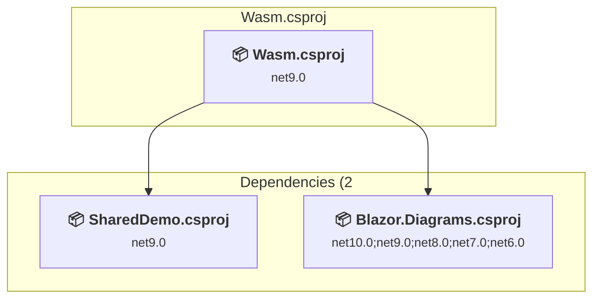

### API Compatibility

| Category | Count | Impact |
| :--- | :---: | :--- |
| 🔴 Binary Incompatible | 0 | High - Require code changes |
| 🟡 Source Incompatible | 0 | Medium - Needs re-compilation and potential conflicting API error fixing |
| 🔵 Behavioral change | 3 | Low - Behavioral changes that may require testing at runtime |
| ✅ Compatible | 93 |  |
| ***Total APIs Analyzed*** | ***96*** |  |

### site\Site\Site.csproj

#### Project Info

- **Current Target Framework:** net9.0
- **Proposed Target Framework:** net10.0
- **SDK-style**: True
- **Project Kind:** AspNetCore
- **Dependencies**: 3
- **Dependants**: 0
- **Number of Files**: 104
- **Number of Files with Incidents**: 2
- **Lines of Code**: 921
- **Estimated LOC to modify**: 3+ (at least 0.3% of the project)

#### Dependency Graph

Legend:
📦 SDK-style project
⚙️ Classic project

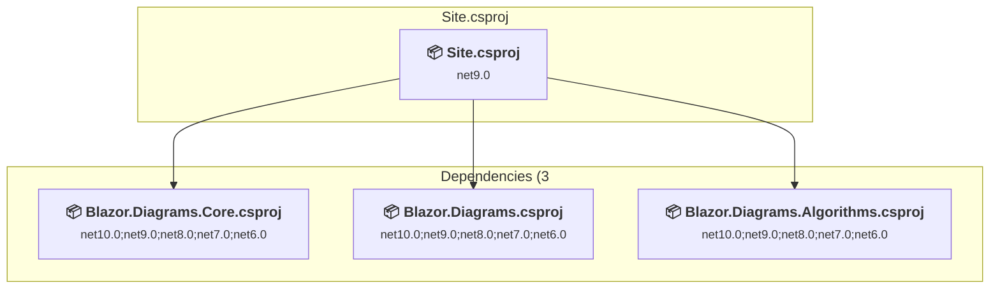

### API Compatibility

| Category | Count | Impact |
| :--- | :---: | :--- |
| 🔴 Binary Incompatible | 0 | High - Require code changes |
| 🟡 Source Incompatible | 0 | Medium - Needs re-compilation and potential conflicting API error fixing |
| 🔵 Behavioral change | 3 | Low - Behavioral changes that may require testing at runtime |
| ✅ Compatible | 5421 |  |
| ***Total APIs Analyzed*** | ***5424*** |  |

### src\Blazor.Diagrams.Algorithms\Blazor.Diagrams.Algorithms.csproj

#### Project Info

- **Current Target Framework:** net10.0;net9.0;net8.0;net7.0;net6.0
- **Proposed Target Framework:** net10.0;net9.0;net8.0;net7.0;net6.0;net10.0
- **SDK-style**: True
- **Project Kind:** ClassLibrary
- **Dependencies**: 1
- **Dependants**: 2
- **Number of Files**: 1
- **Number of Files with Incidents**: 1
- **Lines of Code**: 65
- **Estimated LOC to modify**: 0+ (at least 0.0% of the project)

#### Dependency Graph

Legend:
📦 SDK-style project
⚙️ Classic project

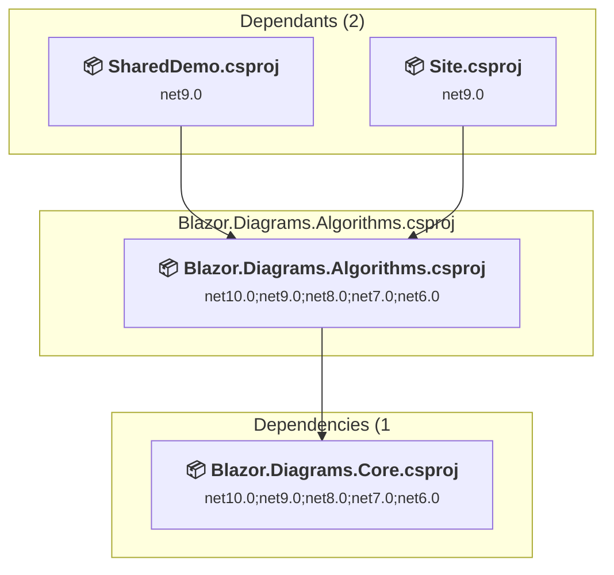

### API Compatibility

| Category | Count | Impact |
| :--- | :---: | :--- |
| 🔴 Binary Incompatible | 0 | High - Require code changes |
| 🟡 Source Incompatible | 0 | Medium - Needs re-compilation and potential conflicting API error fixing |
| 🔵 Behavioral change | 0 | Low - Behavioral changes that may require testing at runtime |
| ✅ Compatible | 26 |  |
| ***Total APIs Analyzed*** | ***26*** |  |

### src\Blazor.Diagrams.Core\Blazor.Diagrams.Core.csproj

#### Project Info

- **Current Target Framework:** net10.0;net9.0;net8.0;net7.0;net6.0
- **Proposed Target Framework:** net10.0;net9.0;net8.0;net7.0;net6.0;net10.0
- **SDK-style**: True
- **Project Kind:** ClassLibrary
- **Dependencies**: 0
- **Dependants**: 8
- **Number of Files**: 84
- **Number of Files with Incidents**: 1
- **Lines of Code**: 4578
- **Estimated LOC to modify**: 0+ (at least 0.0% of the project)

#### Dependency Graph

Legend:
📦 SDK-style project
⚙️ Classic project

```mermaid
flowchart TB
    subgraph upstream["Dependants (8)"]
        P3["<b>📦&nbsp;Blazor.Diagrams.csproj</b><br/><small>net10.0;net9.0;net8.0;net7.0;net6.0</small>"]
        P4["<b>📦&nbsp;SharedDemo.csproj</b><br/><small>net9.0</small>"]
        P6["<b>📦&nbsp;Blazor.Diagrams.Algorithms.csproj</b><br/><small>net10.0;net9.0;net8.0;net7.0;net6.0</small>"]
        P7["<b>📦&nbsp;Blazor.Diagrams.Core.Tests.csproj</b><br/><small>net10.0;net9.0;net8.0;net7.0;net6.0</small>"]
        P8["<b>📦&nbsp;Diagram-Demo.csproj</b><br/><small>net9.0</small>"]
        P9["<b>📦&nbsp;CustomNodesLinks.csproj</b><br/><small>net9.0</small>"]
        P10["<b>📦&nbsp;Layouts.csproj</b><br/><small>net9.0</small>"]
        P12["<b>📦&nbsp;Site.csproj</b><br/><small>net9.0</small>"]
        click P3 "#srcblazordiagramsblazordiagramscsproj"
        click P4 "#samplesshareddemoshareddemocsproj"
        click P6 "#srcblazordiagramsalgorithmsblazordiagramsalgorithmscsproj"
        click P7 "#testsblazordiagramscoretestsblazordiagramscoretestscsproj"
        click P8 "#docsdiagram-demodiagram-democsproj"
        click P9 "#docscustomnodeslinkscustomnodeslinkscsproj"
        click P10 "#docslayoutslayoutscsproj"
        click P12 "#sitesitesitecsproj"
    end
    subgraph current["Blazor.Diagrams.Core.csproj"]
        MAIN["<b>📦&nbsp;Blazor.Diagrams.Core.csproj</b><br/><small>net10.0;net9.0;net8.0;net7.0;net6.0</small>"]
        click MAIN "#srcblazordiagramscoreblazordiagramscorecsproj"
    end
    P3 --> MAIN
    P4 --> MAIN
    P6 --> MAIN
    P7 --> MAIN
    P8 --> MAIN
    P9 --> MAIN
    P10 --> MAIN
    P12 --> MAIN

```

### API Compatibility

| Category | Count | Impact |
| :--- | :---: | :--- |
| 🔴 Binary Incompatible | 0 | High - Require code changes |
| 🟡 Source Incompatible | 0 | Medium - Needs re-compilation and potential conflicting API error fixing |
| 🔵 Behavioral change | 0 | Low - Behavioral changes that may require testing at runtime |
| ✅ Compatible | 4128 |  |
| ***Total APIs Analyzed*** | ***4128*** |  |

### src\Blazor.Diagrams\Blazor.Diagrams.csproj

#### Project Info

- **Current Target Framework:** net10.0;net9.0;net8.0;net7.0;net6.0
- **Proposed Target Framework:** net10.0;net9.0;net8.0;net7.0;net6.0;net10.0
- **SDK-style**: True
- **Project Kind:** ClassLibrary
- **Dependencies**: 1
- **Dependants**: 7
- **Number of Files**: 48
- **Number of Files with Incidents**: 1
- **Lines of Code**: 1625
- **Estimated LOC to modify**: 0+ (at least 0.0% of the project)

#### Dependency Graph

Legend:
📦 SDK-style project
⚙️ Classic project

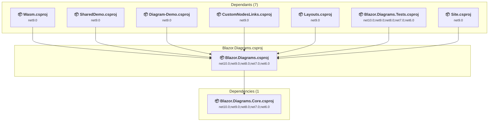

### API Compatibility

| Category | Count | Impact |
| :--- | :---: | :--- |
| 🔴 Binary Incompatible | 0 | High - Require code changes |
| 🟡 Source Incompatible | 0 | Medium - Needs re-compilation and potential conflicting API error fixing |
| 🔵 Behavioral change | 0 | Low - Behavioral changes that may require testing at runtime |
| ✅ Compatible | 2502 |  |
| ***Total APIs Analyzed*** | ***2502*** |  |

### tests\Blazor.Diagrams.Core.Tests\Blazor.Diagrams.Core.Tests.csproj

#### Project Info

- **Current Target Framework:** net10.0;net9.0;net8.0;net7.0;net6.0
- **Proposed Target Framework:** net10.0;net9.0;net8.0;net7.0;net6.0;net10.0
- **SDK-style**: True
- **Project Kind:** DotNetCoreApp
- **Dependencies**: 1
- **Dependants**: 0
- **Number of Files**: 21
- **Number of Files with Incidents**: 1
- **Lines of Code**: 2562
- **Estimated LOC to modify**: 0+ (at least 0.0% of the project)

#### Dependency Graph

Legend:
📦 SDK-style project
⚙️ Classic project

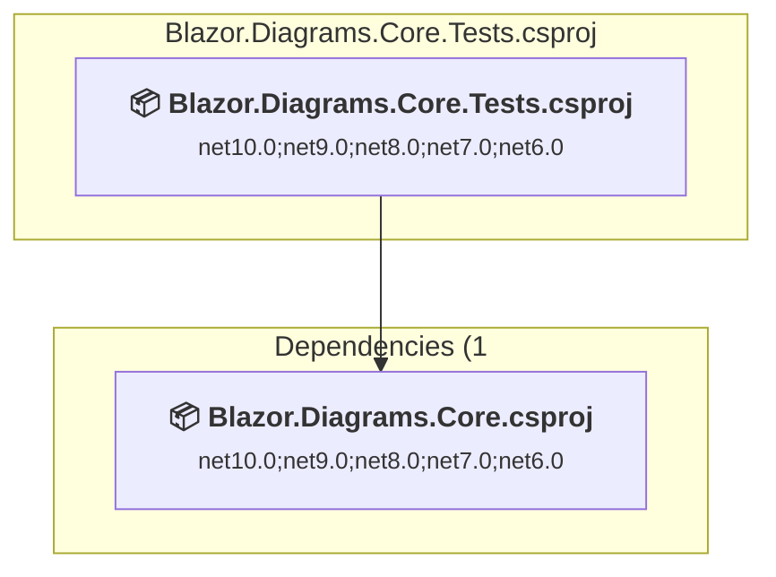

### API Compatibility

| Category | Count | Impact |
| :--- | :---: | :--- |
| 🔴 Binary Incompatible | 0 | High - Require code changes |
| 🟡 Source Incompatible | 0 | Medium - Needs re-compilation and potential conflicting API error fixing |
| 🔵 Behavioral change | 0 | Low - Behavioral changes that may require testing at runtime |
| ✅ Compatible | 1999 |  |
| ***Total APIs Analyzed*** | ***1999*** |  |

### tests\Blazor.Diagrams.Tests\Blazor.Diagrams.Tests.csproj

#### Project Info

- **Current Target Framework:** net10.0;net9.0;net8.0;net7.0;net6.0
- **Proposed Target Framework:** net10.0;net9.0;net8.0;net7.0;net6.0;net10.0
- **SDK-style**: True
- **Project Kind:** DotNetCoreApp
- **Dependencies**: 1
- **Dependants**: 0
- **Number of Files**: 10
- **Number of Files with Incidents**: 1
- **Lines of Code**: 340
- **Estimated LOC to modify**: 0+ (at least 0.0% of the project)

#### Dependency Graph

Legend:
📦 SDK-style project
⚙️ Classic project

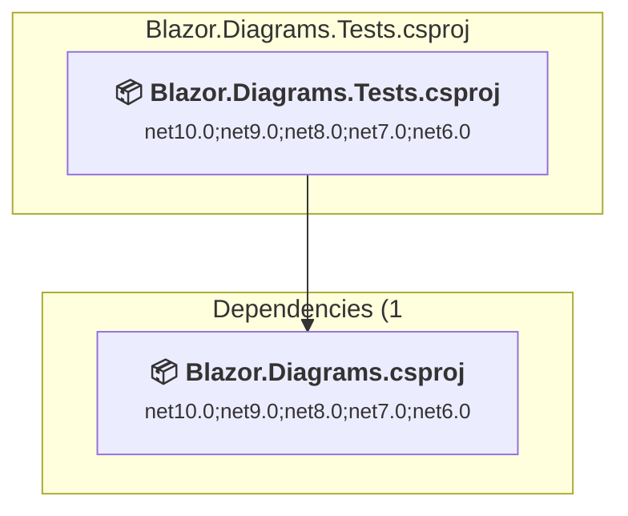

### API Compatibility

| Category | Count | Impact |
| :--- | :---: | :--- |
| 🔴 Binary Incompatible | 0 | High - Require code changes |
| 🟡 Source Incompatible | 0 | Medium - Needs re-compilation and potential conflicting API error fixing |
| 🔵 Behavioral change | 0 | Low - Behavioral changes that may require testing at runtime |
| ✅ Compatible | 424 |  |
| ***Total APIs Analyzed*** | ***424*** |  |

